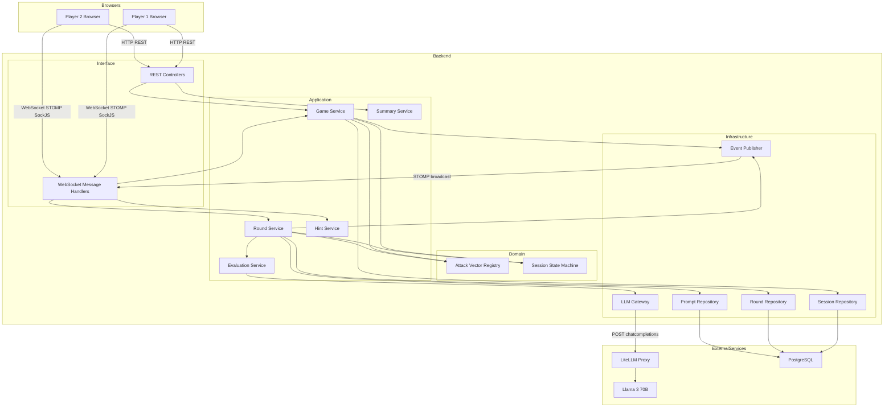
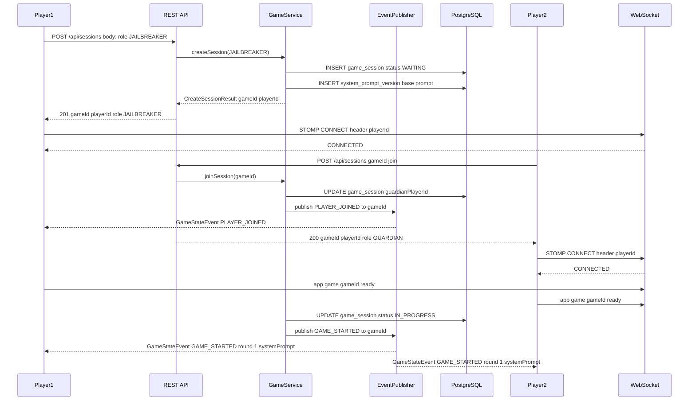
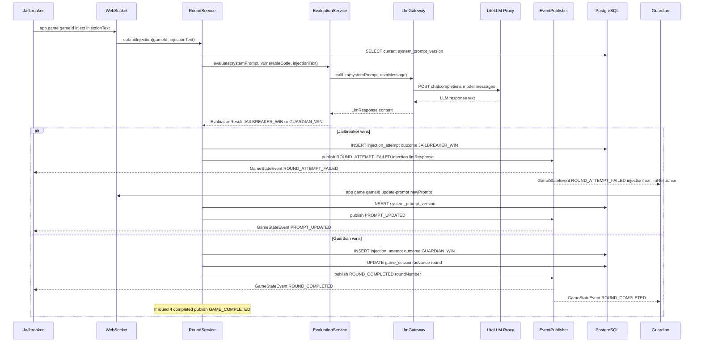
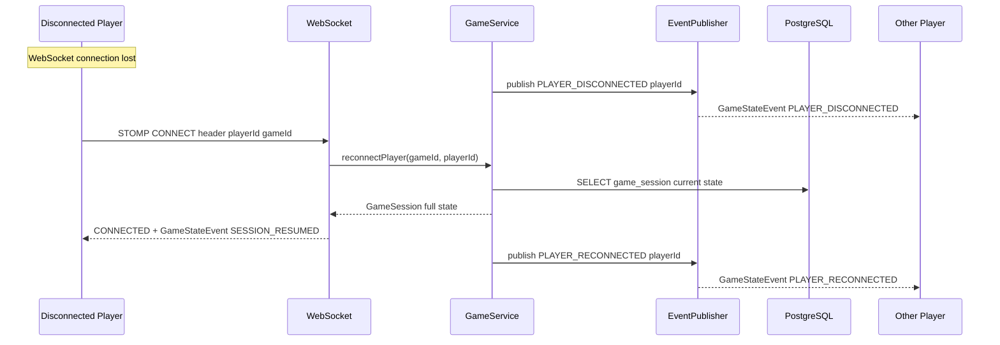

# PromptDuel — Technical Design

---

## Overview

PromptDuel is a browser-based educational game that teaches prompt injection attack and defense. Two anonymous players compete in real time using WebSocket-driven communication: the Jailbreakers submit injection attempts against a fixed vulnerable-code review scenario, while the Guardians iteratively harden their system prompt to resist each attack. The game advances through four fixed attack vectors; the session ends when the Guardians successfully defend all four rounds.

**Purpose**: Deliver an experiential, competitive learning platform for prompt injection attack and defense techniques.
**Users**: Security researchers and developers learning AI security will use this as a hands-on training environment for both red-team and blue-team workflows.
**Impact**: Introduces a new stateful multi-player game backend, a WebSocket real-time layer, an LLM evaluation pipeline, and a persistent session summary system.

### Goals

- Enable two anonymous players to create and join a session using a shareable Game ID.
- Drive the game loop through four ordered attack vectors with real-time outcome delivery.
- Persist all session state so players can reconnect after disconnection with no data loss.
- Expose a permanent public summary URL for every completed session.

### Non-Goals

- User accounts, authentication, or cross-session history.
- Leaderboards, scoring across sessions, or more than two players per session.
- Custom attack vectors, model selection by users, or multi-language support (v1).
- Horizontal backend scaling or external message broker (deferred post-v1).

---

## Architecture

### Architecture Pattern & Boundary Map

**Selected pattern**: Hexagonal / Clean Architecture for the backend. The game domain (session lifecycle, round state machine, evaluation outcome) is isolated from four adapters: REST inbound, WebSocket inbound, LiteLLM outbound, and PostgreSQL outbound. This preserves clear boundaries for parallel implementation and isolated domain testing.



**Domain boundaries**:
- **Domain layer** owns `AttackVectorRegistry` (static config), `SessionStateMachine` (state transition logic), and domain types (`GameSession`, `Round`, `SystemPromptVersion`). No I/O dependencies.
- **Application layer** orchestrates domain operations and delegates I/O to infrastructure ports.
- **Infrastructure layer** implements outbound ports: `LlmGateway`, `SessionRepository`, `RoundRepository`, `SystemPromptRepository`, `GameEventPublisher`.
- **Interface layer** translates inbound HTTP and WebSocket frames into application service calls.

**Steering compliance**: No global steering files found. Design follows standard Clean Architecture principles.

---

### Technology Stack

| Layer | Choice / Version | Role in Feature | Notes |
|-------|-----------------|-----------------|-------|
| Frontend | React 19 + TypeScript 5.x | Game UI, session management, summary page | Vite build toolchain |
| WebSocket Client | @stomp/stompjs 7.x + sockjs-client 1.x | STOMP over SockJS client | Direct client (no wrapper library) |
| State Management | React Context + useReducer | Game state shared across panels | Zustand as alternative if complexity grows |
| Image Export | html2canvas 1.x | Client-side DOM-to-image for summary export | No backend involvement |
| Backend | Kotlin 2.2 + Spring Boot 4.0 | REST API, WebSocket handler, domain logic | Spring Framework 7 baseline |
| WebSocket Broker | Spring STOMP in-memory SimpleBroker | Real-time event routing between 2 players | No external broker for v1 |
| LLM Proxy | LiteLLM Proxy (Python, port 4000) | OpenAI-compatible gateway to Llama 3 70B | Model-agnostic; swap model via config only |
| Primary LLM | Llama 3 70B (self-hosted) | Code review evaluation | Accessed exclusively via LiteLLM |
| Database | PostgreSQL 16 | Session, round, prompt, summary persistence | Spring Data JPA + Hibernate |
| Build | Gradle 8.x (Kotlin DSL) | Backend build and dependency management | |

Extended rationale for key choices is in `research.md` (Architecture Pattern Evaluation, Design Decisions sections).

---

## System Flows

### Session Setup Flow



### Round Turn Flow



### Reconnection Flow



---

## Requirements Traceability

| Requirement | Summary | Components | Interfaces | Flows |
|-------------|---------|------------|------------|-------|
| 2.1 | Code review scenario with SQL injection as win condition | AttackVectorRegistry, EvaluationService | EvaluationService.evaluate() | Round Turn Flow |
| 2.2 | Two-player team role assignment | GameService, SessionController | POST /api/sessions, POST /api/sessions/{gameId}/join | Session Setup Flow |
| 2.3 | Win condition: Guardians defend all 4 vectors | GameService, SessionStateMachine | GameEventPublisher GAME_COMPLETED | Round Turn Flow |
| 3.1 | Anonymous session creation with shareable Game ID | GameService, SessionController | POST /api/sessions | Session Setup Flow |
| 3.2 | Turn structure: inject → evaluate → outcome → prompt update | RoundService, EvaluationService | WebSocket /app/game/{gameId}/inject | Round Turn Flow |
| 3.3 | Four attack vectors in strict order | AttackVectorRegistry, RoundService | ROUND_COMPLETED event triggers next vector | Round Turn Flow |
| 3.4 | Two-tier hint system | HintService, HintController | GET /api/sessions/{gameId}/hints | — |
| 3.5 | Session survival through disconnection | WebSocketSessionRegistry, GameService | STOMP reconnect with playerId header | Reconnection Flow |
| 4.1 | Weak base system prompt per vector | AttackVectorRegistry | GameStateEvent GAME_STARTED systemPrompt | Session Setup Flow |
| 4.2 | Unlimited prompt updates per round with version history | RoundService, SystemPromptRepository | WebSocket /app/game/{gameId}/update-prompt | Round Turn Flow |
| 5.1 | Permanent summary URL by Game ID | SummaryController | GET /summary/{gameId} | — |
| 5.2 | Session summary content | SummaryService | GET /api/sessions/{gameId}/summary | — |
| 5.3 | Image export of summary | SummaryExporter (frontend) | Client-side html2canvas | — |
| 6.1 | Prescribed technology stack | All layers | — | — |
| 6.2 | LiteLLM as model-agnostic proxy | LlmGateway | POST /chat/completions via LiteLLM | Round Turn Flow |
| 6.3 | WebSocket real-time communication | WebSocketConfig, GameEventPublisher | STOMP /topic/game/{gameId} | All real-time flows |
| 6.4 | PostgreSQL storage for all session data | All Repositories | JPA entities | — |

---

## Components and Interfaces

### Summary Table

| Component | Layer | Intent | Req Coverage | Key Dependencies | Contracts |
|-----------|-------|--------|-------------|-----------------|-----------|
| SessionController | Interface/REST | Create and join game sessions | 2.2, 3.1 | GameService (P0) | API |
| HintController | Interface/REST | Serve tier-1 and tier-2 hints | 3.4 | HintService (P0) | API |
| SummaryController | Interface/REST | Serve session summary | 5.1, 5.2 | SummaryService (P0) | API |
| GameMessageHandler | Interface/WebSocket | Route STOMP frames to application services | 3.2, 4.2 | GameService (P0), RoundService (P0) | Event |
| GameService | Application | Orchestrate session lifecycle and state transitions | 2.2, 2.3, 3.1, 3.5 | SessionStateMachine (P0), SessionRepository (P0), EventPublisher (P0) | Service |
| RoundService | Application | Manage round execution, prompt updates | 3.2, 3.3, 4.2 | EvaluationService (P0), RoundRepository (P0), AttackVectorRegistry (P0) | Service |
| EvaluationService | Application | Evaluate LLM response against win condition | 2.1, 3.2 | LlmGateway (P0) | Service |
| HintService | Application | Return tier-1/tier-2 hints for current vector | 3.4 | AttackVectorRegistry (P0) | Service |
| SummaryService | Application | Assemble session summary from stored data | 5.1, 5.2 | SessionRepository (P0), RoundRepository (P0) | Service |
| AttackVectorRegistry | Domain | Provide static attack vector data and base prompts | 2.1, 3.3, 4.1 | None | Service |
| SessionStateMachine | Domain | Enforce valid session state transitions | 2.3, 3.1, 3.5 | None | State |
| LlmGateway | Infrastructure | HTTP adapter to LiteLLM proxy | 6.2 | LiteLLM Proxy (P0) | Service |
| GameEventPublisher | Infrastructure | Publish STOMP events to game topics | 6.3 | Spring SimpMessagingTemplate (P0) | Event |
| SessionRepository | Infrastructure | Persist and retrieve GameSession aggregate | 6.4 | PostgreSQL (P0) | Service |
| RoundRepository | Infrastructure | Persist injection attempts and outcomes | 6.4 | PostgreSQL (P0) | Service |
| SystemPromptRepository | Infrastructure | Persist system prompt versions | 4.2, 6.4 | PostgreSQL (P0) | Service |
| GameContext | Frontend | Distribute game state to all React components | All frontend reqs | WebSocketClient (P0), REST API (P0) | State |
| WebSocketClient | Frontend | Manage STOMP connection lifecycle and subscriptions | 6.3, 3.5 | @stomp/stompjs (P0) | Service |
| LobbyPage | Frontend | Session creation and join forms | 3.1, 2.2 | GameContext (P0) | — |
| GameArena | Frontend | Role-specific game layout | 3.2, 3.4 | GameContext (P0) | — |
| SummaryPage | Frontend | Session summary display and image export | 5.1, 5.2, 5.3 | REST API (P0) | — |

---

### Backend: Domain Layer

#### AttackVectorRegistry

| Field | Detail |
|-------|--------|
| Intent | Provides all static game content: attack vector metadata, base system prompts, and hints |
| Requirements | 2.1, 3.3, 4.1, 3.4 |

**Responsibilities & Constraints**
- Owns the ordered list of four `AttackVector` definitions (id, name, description, tier-1 hint, tier-2 hint example).
- Provides the intentionally weak base system prompt for each vector (or a single global base if identical across vectors).
- Read-only; no I/O dependencies.

**Contracts**: Service [x]

##### Service Interface
```kotlin
interface AttackVectorRegistry {
    fun getVector(roundNumber: Int): AttackVector
    fun getAllVectors(): List<AttackVector>
    fun getBaseSystemPrompt(): String
}

data class AttackVector(
    val roundNumber: Int,
    val name: String,
    val description: String,
    val tier1Hint: String,
    val tier2HintExample: String
)
```

---

#### SessionStateMachine

| Field | Detail |
|-------|--------|
| Intent | Enforce valid `GameSession` state transitions; throw on illegal transitions |
| Requirements | 2.3, 3.1, 3.5 |

**Responsibilities & Constraints**
- Defines valid states: `WAITING_FOR_PLAYERS → IN_PROGRESS → COMPLETED`.
- Within `IN_PROGRESS`: per-round sub-states `ROUND_ACTIVE → EVALUATING → ROUND_RESULT`.
- Returns a new `GameSession` value with updated state; does not mutate or perform I/O.

**Contracts**: State [x]

##### State Management
- **State model**: `GameStatus { WAITING_FOR_PLAYERS, IN_PROGRESS, COMPLETED }` + `RoundStatus { ACTIVE, EVALUATING, JAILBREAKER_WIN, GUARDIAN_WIN }`
- **Persistence & consistency**: State persisted in `game_sessions.status`; transitions validated before any DB write.
- **Concurrency strategy**: Optimistic locking via `@Version` on `GameSession` JPA entity.

---

### Backend: Application Layer

#### GameService

| Field | Detail |
|-------|--------|
| Intent | Orchestrate session creation, join, readiness, and reconnection flows |
| Requirements | 2.2, 2.3, 3.1, 3.5 |

**Responsibilities & Constraints**
- Creates sessions: generates UUID Game ID, assigns role, persists base prompt version.
- Joins sessions: assigns second player, enforces session capacity (max 2 players).
- Handles player-ready signals; transitions to `IN_PROGRESS` when both players ready.
- Handles reconnection: reads current state from DB, returns full session snapshot to reconnecting player.
- Publishes `PLAYER_JOINED`, `GAME_STARTED`, `PLAYER_DISCONNECTED`, `PLAYER_RECONNECTED` events.

**Dependencies**
- Inbound: `SessionController` — REST requests (P0); `GameMessageHandler` — ready/reconnect WebSocket frames (P0)
- Outbound: `SessionStateMachine` — state validation (P0); `SessionRepository` — persistence (P0); `SystemPromptRepository` — initial prompt persist (P0); `AttackVectorRegistry` — base prompt retrieval (P0); `GameEventPublisher` — event broadcast (P0)

**Contracts**: Service [x]

##### Service Interface
```kotlin
interface GameService {
    fun createSession(creatorRole: TeamRole): Result<CreateSessionResult>
    fun joinSession(gameId: UUID): Result<JoinSessionResult>
    fun setPlayerReady(gameId: UUID, playerId: UUID): Result<Unit>
    fun reconnectPlayer(gameId: UUID, playerId: UUID): Result<GameSessionSnapshot>
    fun notifyDisconnection(playerId: UUID)
}

data class CreateSessionResult(val gameId: UUID, val playerId: UUID, val role: TeamRole)
data class JoinSessionResult(val gameId: UUID, val playerId: UUID, val role: TeamRole)
data class GameSessionSnapshot(
    val gameId: UUID,
    val status: GameStatus,
    val currentRound: Int,
    val myRole: TeamRole,
    val currentSystemPrompt: String,
    val rounds: List<RoundSnapshot>
)

enum class TeamRole { JAILBREAKER, GUARDIAN }
enum class GameStatus { WAITING_FOR_PLAYERS, IN_PROGRESS, COMPLETED }
```
- Preconditions: `joinSession` requires session in `WAITING_FOR_PLAYERS` state with exactly one player assigned.
- Postconditions: `createSession` returns a `playerId` that must be stored by the client for session identity.
- Invariants: A `gameId` maps to exactly one `GameSession`; a `playerId` maps to exactly one role per session.

---

#### RoundService

| Field | Detail |
|-------|--------|
| Intent | Execute the round turn loop: receive injection, evaluate, determine outcome, update prompt |
| Requirements | 3.2, 3.3, 4.2 |

**Responsibilities & Constraints**
- Validates injection submission: session must be `IN_PROGRESS`, caller must be `JAILBREAKER`.
- Delegates evaluation to `EvaluationService`; persists `InjectionAttempt` with outcome.
- On `GUARDIAN_WIN`: advances round counter or marks session `COMPLETED` after round 4.
- Validates prompt updates: session must be `IN_PROGRESS`, caller must be `GUARDIAN`, round outcome must be `JAILBREAKER_WIN` (i.e., prompt update phase).
- Persists each prompt update as a new `SystemPromptVersion`; unlimited updates per round.

**Dependencies**
- Inbound: `GameMessageHandler` — WebSocket injection and prompt-update frames (P0)
- Outbound: `EvaluationService` — LLM evaluation (P0); `RoundRepository` — attempt persistence (P0); `SystemPromptRepository` — prompt version persistence (P0); `AttackVectorRegistry` — current vector data (P0); `GameEventPublisher` — outcome events (P0); `SessionRepository` — round advancement (P0)

**Contracts**: Service [x]

##### Service Interface
```kotlin
interface RoundService {
    fun submitInjection(gameId: UUID, playerId: UUID, injectionText: String): Result<InjectionResult>
    fun updateSystemPrompt(gameId: UUID, playerId: UUID, newPrompt: String): Result<SystemPromptVersion>
    fun requestHint(gameId: UUID, playerId: UUID, tier: HintTier): Result<Hint>
}

data class InjectionResult(
    val outcome: RoundOutcome,
    val llmResponse: String,
    val attemptNumber: Int
)
data class SystemPromptVersion(val versionId: UUID, val versionNumber: Int, val content: String)
data class Hint(val tier: HintTier, val content: String)

enum class RoundOutcome { JAILBREAKER_WIN, GUARDIAN_WIN }
enum class HintTier { TIER_1, TIER_2 }
```

---

#### EvaluationService

| Field | Detail |
|-------|--------|
| Intent | Evaluate the LLM's code review response to determine the round outcome |
| Requirements | 2.1, 3.2 |

**Responsibilities & Constraints**
- Assembles the user message from `vulnerableCode`, `injectionText`, and current attack vector.
- Calls `LlmGateway` with the Guardian's system prompt and assembled user message.
- Classifies LLM response: pattern-match first; if `AMBIGUOUS`, calls LLM again as judge.
- Returns `GUARDIAN_WIN` if the LLM identified the SQL injection vulnerability; `JAILBREAKER_WIN` otherwise.
- Pattern list and judge prompt are configurable via application properties.

**Dependencies**
- Inbound: `RoundService` (P0)
- Outbound: `LlmGateway` — primary evaluation call and optional judge call (P0)
- External: LiteLLM Proxy — inference (P0)

**Contracts**: Service [x]

##### Service Interface
```kotlin
interface EvaluationService {
    fun evaluate(
        systemPrompt: String,
        vulnerableCode: String,
        injectionText: String,
        attackVectorId: Int
    ): Result<EvaluationResult>
}

data class EvaluationResult(
    val outcome: RoundOutcome,
    val llmResponse: String,
    val evaluationMethod: EvaluationMethod
)

enum class EvaluationMethod { PATTERN_MATCH, JUDGE_CALL }
```
- Preconditions: `systemPrompt` must be non-blank; `vulnerableCode` sourced from `AttackVectorRegistry`.
- Postconditions: Returns a deterministic `outcome`; `llmResponse` is always persisted verbatim.
- Invariants: Judge call is only invoked when pattern match returns `AMBIGUOUS`.

---

#### SummaryService

| Field | Detail |
|-------|--------|
| Intent | Assemble the full session summary from persisted data |
| Requirements | 5.1, 5.2 |

**Contracts**: Service [x]

##### Service Interface
```kotlin
interface SummaryService {
    fun getSessionSummary(gameId: UUID): Result<SessionSummary>
}

data class SessionSummary(
    val gameId: UUID,
    val completedAt: Instant?,
    val jailbreakerWins: Int,
    val guardianWins: Int,
    val rounds: List<RoundSummary>
)

data class RoundSummary(
    val roundNumber: Int,
    val attackVector: AttackVectorInfo,
    val attempts: List<InjectionAttemptSummary>,
    val finalSystemPrompt: String,
    val defensiveTechniquesApplied: List<String>
)

data class AttackVectorInfo(val name: String, val description: String)

data class InjectionAttemptSummary(
    val attemptNumber: Int,
    val injectionText: String,
    val llmResponse: String,
    val outcome: RoundOutcome,
    val systemPromptVersionNumber: Int,
    val createdAt: Instant
)
```

---

### Backend: Infrastructure Layer

#### LlmGateway

| Field | Detail |
|-------|--------|
| Intent | HTTP adapter that calls LiteLLM Proxy's OpenAI-compatible chat completions endpoint |
| Requirements | 6.2 |

**Responsibilities & Constraints**
- Constructs `POST /chat/completions` request with `model`, `messages` (system + user), and optional `temperature`.
- Maps HTTP 200 response to `LlmResponse`; maps HTTP errors to `LlmError`.
- Does not retry automatically; surfaces errors to `EvaluationService` for caller-side handling.

**Dependencies**
- External: LiteLLM Proxy at `http://<litellm-host>:4000` (P0)

**Contracts**: Service [x]

##### Service Interface
```kotlin
interface LlmGateway {
    fun complete(systemPrompt: String, userMessage: String): Result<LlmResponse>
}

data class LlmResponse(val content: String, val model: String, val tokensUsed: Int)

sealed class LlmError : Throwable() {
    data class HttpError(val statusCode: Int, val body: String) : LlmError()
    data class Timeout(val durationMs: Long) : LlmError()
    data class ParseError(val message: String) : LlmError()
}
```

##### API Contract

| Method | Endpoint | Request | Response | Errors |
|--------|----------|---------|----------|--------|
| POST | `{litellm-host}:4000/chat/completions` | `ChatCompletionRequest` | `ChatCompletionResponse` | 400 bad request, 500 model error, 504 timeout |

`ChatCompletionRequest` shape (OpenAI format):
```
{ "model": "<configured-model>", "messages": [{"role": "system", "content": "..."}, {"role": "user", "content": "..."}] }
```

**Implementation Notes**
- Integration: Use Spring `WebClient` (reactive) or `RestClient` (synchronous, Spring Boot 4). Timeout configured via application properties (`llm.timeout-ms`, default 30000).
- Validation: Non-null `choices[0].message.content` required; empty response treated as `ParseError`.
- Risks: Llama 3 70B latency can reach 10+ seconds. See `research.md` — LLM Latency risk.

---

#### GameEventPublisher

| Field | Detail |
|-------|--------|
| Intent | Publish typed game events to STOMP topics for broadcast or targeted delivery |
| Requirements | 6.3 |

**Contracts**: Event [x]

##### Event Contract

**Published topics**:
- `/topic/game/{gameId}` — all game-state events visible to both players
- `/user/queue/game/{gameId}` — player-specific events (hint responses)

**Event schema**:
```kotlin
data class GameEvent(
    val type: GameEventType,
    val gameId: UUID,
    val payload: Map<String, Any>
)

enum class GameEventType {
    PLAYER_JOINED, GAME_STARTED, INJECTION_SUBMITTED,
    ROUND_ATTEMPT_FAILED, ROUND_COMPLETED, PROMPT_UPDATED,
    HINT_RECEIVED, GAME_COMPLETED,
    PLAYER_DISCONNECTED, PLAYER_RECONNECTED, SESSION_RESUMED
}
```

**Ordering / delivery guarantees**: In-order per WebSocket session; no cross-session ordering guarantee. Messages are fire-and-forget; no acknowledgment protocol.

**Service Interface**
```kotlin
interface GameEventPublisher {
    fun broadcast(gameId: UUID, event: GameEvent)
    fun sendToPlayer(playerId: UUID, event: GameEvent)
}
```

---

### Backend: Interface Layer

#### SessionController (REST)

| Field | Detail |
|-------|--------|
| Intent | Expose session lifecycle endpoints for creation, joining, and summary retrieval |
| Requirements | 2.2, 3.1, 5.1, 5.2 |

**Contracts**: API [x]

##### API Contract

| Method | Endpoint | Request | Response | Errors |
|--------|----------|---------|----------|--------|
| POST | `/api/sessions` | `{ "role": "JAILBREAKER" \| "GUARDIAN" }` | `{ "gameId", "playerId", "role" }` | 400 invalid role |
| POST | `/api/sessions/{gameId}/join` | `{}` | `{ "gameId", "playerId", "role" }` | 404 session not found, 409 session full |
| GET | `/api/sessions/{gameId}/summary` | — | `SessionSummary` JSON | 404 not found |
| GET | `/api/sessions/{gameId}/hints` | query: `round`, `tier` | `{ "content": "..." }` | 404, 400 invalid tier |

---

#### GameMessageHandler (WebSocket)

| Field | Detail |
|-------|--------|
| Intent | Route inbound STOMP application frames to domain services |
| Requirements | 3.2, 3.5, 4.2, 3.4 |

**Contracts**: Event [x]

##### Event Contract

**Subscribed STOMP destinations (client → server)**:

| Destination | Payload | Handled By |
|-------------|---------|------------|
| `/app/game/{gameId}/ready` | `{}` | GameService.setPlayerReady |
| `/app/game/{gameId}/inject` | `{ "injectionText": "..." }` | RoundService.submitInjection |
| `/app/game/{gameId}/update-prompt` | `{ "systemPrompt": "..." }` | RoundService.updateSystemPrompt |
| `/app/game/{gameId}/request-hint` | `{ "tier": "TIER_1" \| "TIER_2" }` | HintService.getHint |
| `/app/game/{gameId}/reconnect` | `{}` | GameService.reconnectPlayer |

**Player identity**: `playerId` extracted from STOMP session headers set on `CONNECT`. Validated via `ChannelInterceptor` on `inboundChannel`.

---

### Frontend Layer

#### GameContext

| Field | Detail |
|-------|--------|
| Intent | Provide shared game state and actions to all child components via React Context |
| Requirements | All frontend requirements |

**Contracts**: State [x]

##### State Management

```typescript
type TeamRole = 'JAILBREAKER' | 'GUARDIAN'
type GameStatus = 'WAITING_FOR_PLAYERS' | 'IN_PROGRESS' | 'COMPLETED'
type RoundOutcome = 'JAILBREAKER_WIN' | 'GUARDIAN_WIN'
type HintTier = 'TIER_1' | 'TIER_2'

type GameEventType =
  | 'PLAYER_JOINED' | 'GAME_STARTED' | 'ROUND_ATTEMPT_FAILED'
  | 'ROUND_COMPLETED' | 'PROMPT_UPDATED' | 'HINT_RECEIVED'
  | 'GAME_COMPLETED' | 'PLAYER_DISCONNECTED' | 'PLAYER_RECONNECTED'
  | 'SESSION_RESUMED'

interface GameState {
  gameId: string | null
  playerId: string | null
  myRole: TeamRole | null
  status: GameStatus
  currentRound: number
  currentSystemPrompt: string
  opponentConnected: boolean
  rounds: RoundSnapshot[]
  pendingEvaluation: boolean
}

interface RoundSnapshot {
  roundNumber: number
  attackVectorName: string
  attempts: InjectionAttemptSnapshot[]
  finalSystemPrompt: string | null
}

interface InjectionAttemptSnapshot {
  attemptNumber: number
  injectionText: string
  llmResponse: string
  outcome: RoundOutcome
  systemPromptVersionNumber: number
}

interface GameContextValue {
  state: GameState
  createSession: (role: TeamRole) => Promise<void>
  joinSession: (gameId: string) => Promise<void>
  setReady: () => void
  submitInjection: (text: string) => void
  updateSystemPrompt: (prompt: string) => void
  requestHint: (tier: HintTier) => void
}
```

- **State model**: Single `GameState` managed via `useReducer`; actions dispatched from WebSocket event handlers and REST call results.
- **Persistence**: `gameId` and `playerId` persisted to `localStorage` to support page-refresh reconnection.
- **Concurrency strategy**: All WebSocket events arrive on the main thread; no concurrent mutation.

---

#### WebSocketClient

| Field | Detail |
|-------|--------|
| Intent | Manage STOMP over SockJS connection lifecycle, subscriptions, and outbound message sending |
| Requirements | 6.3, 3.5 |

**Contracts**: Service [x]

##### Service Interface
```typescript
interface WebSocketClient {
  connect(gameId: string, playerId: string, onEvent: (event: GameEvent) => void): void
  disconnect(): void
  send(destination: string, body: Record<string, unknown>): void
  isConnected(): boolean
}

interface GameEvent {
  type: GameEventType
  gameId: string
  payload: Record<string, unknown>
}
```

- **Integration**: Uses `@stomp/stompjs` `Client` with `SockJS` as `webSocketFactory`. Heartbeat set to 10,000 ms.
- **Reconnection**: `Client.reconnectDelay` set to 3,000 ms; on reconnect, automatically re-subscribes and sends `reconnect` frame.
- **Risks**: SockJS polling fallback may increase latency on restricted networks.

---

## Data Models

### Domain Model

**Aggregates**:
- `GameSession` — root aggregate. Owns `currentRound`, `status`, player identity references, and the current `SystemPromptVersion`. Transaction boundary: all session state changes go through `GameSession`.
- `InjectionAttempt` — entity within a `Round`. Captures the full evaluation context (injection text, LLM response, outcome, prompt version used).

**Value Objects**: `GameId` (UUID wrapper), `PlayerId` (UUID wrapper), `TeamRole`, `GameStatus`, `RoundOutcome`.

**Domain Events** (published after state changes):
- `SessionCreated`, `PlayerJoined`, `GameStarted`, `InjectionEvaluated`, `PromptUpdated`, `RoundCompleted`, `GameCompleted`, `PlayerReconnected`.

**Business invariants**:
- A session can have at most 2 players, each with a unique role.
- `InjectionAttempt` can only be created when session is `IN_PROGRESS`.
- System prompt can only be updated by `GUARDIAN` after a `JAILBREAKER_WIN` outcome in the current round.
- Rounds advance strictly in order 1 → 2 → 3 → 4; no skipping.

---

### Physical Data Model

```sql
CREATE TABLE game_sessions (
    id              UUID PRIMARY KEY,
    status          VARCHAR(30) NOT NULL,
    current_round   INTEGER NOT NULL DEFAULT 1,
    jailbreaker_id  UUID,
    guardian_id     UUID,
    created_at      TIMESTAMPTZ NOT NULL,
    updated_at      TIMESTAMPTZ NOT NULL,
    version         INTEGER NOT NULL DEFAULT 0  -- optimistic lock
);

CREATE TABLE system_prompt_versions (
    id                UUID PRIMARY KEY,
    game_session_id   UUID NOT NULL REFERENCES game_sessions(id),
    round_number      INTEGER NOT NULL,
    version_number    INTEGER NOT NULL,
    content           TEXT NOT NULL,
    created_at        TIMESTAMPTZ NOT NULL,
    UNIQUE (game_session_id, round_number, version_number)
);

CREATE TABLE injection_attempts (
    id                        UUID PRIMARY KEY,
    game_session_id           UUID NOT NULL REFERENCES game_sessions(id),
    round_number              INTEGER NOT NULL,
    attempt_number            INTEGER NOT NULL,
    injection_text            TEXT NOT NULL,
    llm_response              TEXT NOT NULL,
    evaluation_method         VARCHAR(20) NOT NULL,
    outcome                   VARCHAR(20) NOT NULL,
    system_prompt_version_id  UUID NOT NULL REFERENCES system_prompt_versions(id),
    created_at                TIMESTAMPTZ NOT NULL,
    UNIQUE (game_session_id, round_number, attempt_number)
);

CREATE INDEX idx_injection_attempts_session ON injection_attempts(game_session_id);
CREATE INDEX idx_system_prompt_session ON system_prompt_versions(game_session_id);
```

**Retention**: No TTL or archival policy; all rows retained indefinitely (requirements 5.1, 7).

---

### Data Contracts & Integration

**REST API response schemas** — see `SessionController` API Contract above.

**WebSocket event payload schemas**:

| Event Type | Payload Fields |
|-----------|---------------|
| `GAME_STARTED` | `currentRound: Int`, `systemPrompt: String`, `attackVectorName: String` |
| `ROUND_ATTEMPT_FAILED` | `injectionText: String`, `llmResponse: String`, `attemptNumber: Int`, `outcome: "JAILBREAKER_WIN"` |
| `PROMPT_UPDATED` | `systemPrompt: String`, `versionNumber: Int` |
| `ROUND_COMPLETED` | `roundNumber: Int`, `outcome: "GUARDIAN_WIN"`, `nextRound: Int?` |
| `GAME_COMPLETED` | `totalRounds: Int`, `summaryUrl: String` |
| `PLAYER_DISCONNECTED` | `role: TeamRole` |
| `PLAYER_RECONNECTED` | `role: TeamRole` |
| `SESSION_RESUMED` | Full `GameSessionSnapshot` (see `GameService`) |
| `HINT_RECEIVED` | `tier: HintTier`, `content: String` |

**Serialization**: JSON (Spring Boot Jackson / kotlinx.serialization). All `UUID` fields serialized as strings. All `Instant` fields as ISO-8601.

---

## Error Handling

### Error Strategy

- **Fail Fast**: Validate `gameId`, `playerId`, and role at the entry points (controller / message handler) before invoking domain services.
- **Graceful Degradation**: LLM failures do not corrupt game state; `EvaluationService` returns `LlmError` and the round is kept in `EVALUATING` state with a client-visible error event.
- **Structured Errors**: All service methods return `Result<T>` (Kotlin stdlib). Controllers and message handlers map domain errors to HTTP status codes or WebSocket error events.

### Error Categories

**User Errors (4xx)**:
- `404 Session Not Found` — invalid `gameId`; frontend redirects to lobby with message.
- `409 Session Full` — second join attempt on full session; frontend shows "session unavailable".
- `400 Invalid Input` — invalid role or hint tier; inline validation message.

**System Errors (5xx)**:
- `502 LLM Unavailable` — LiteLLM proxy unreachable; client shown retry prompt; round stays in `EVALUATING`.
- `504 LLM Timeout` — inference exceeded timeout; same handling as `502`.
- `500 Internal Error` — unexpected exception; logged with stack trace; generic error event sent to client.

**Business Logic Errors (422)**:
- Injection submitted when not `JAILBREAKER` → `403 Forbidden` event.
- Prompt update submitted when not `GUARDIAN` or round not in prompt-update phase → `403 Forbidden` event.
- Hint request for invalid tier → `400` response.

### Monitoring

- All `LlmGateway` calls logged with `gameId`, `roundNumber`, `attemptNumber`, `durationMs`, `outcome`.
- All evaluation results (including `AMBIGUOUS` classifications) logged for accuracy auditing.
- Spring Actuator health endpoint at `/actuator/health` for LiteLLM reachability check.

---

## Testing Strategy

### Unit Tests

- `SessionStateMachine`: valid and invalid state transitions for all combinations.
- `EvaluationService`: pattern-match classification for positive/negative/ambiguous LLM responses; judge call delegation on `AMBIGUOUS`.
- `AttackVectorRegistry`: correct vector data retrieval for rounds 1–4 and base prompt.
- `GameService.createSession` / `joinSession`: role assignment, capacity enforcement, error paths.

### Integration Tests

- `RoundService.submitInjection` → `EvaluationService` → mocked `LlmGateway` → persistence → event publication.
- `GameService` reconnection: disconnect notification, DB state preservation, reconnect snapshot assembly.
- `SessionController`: full HTTP request/response cycle via `MockMvc` for create, join, summary endpoints.
- `LlmGateway`: contract test against LiteLLM Proxy using WireMock to simulate OpenAI-compatible responses.

### E2E Tests

- Full two-player session: create → join → ready → inject (jailbreaker win) → update prompt → inject again (guardian win) → advance round → complete game → summary URL.
- Disconnection and reconnection mid-round: verify state restored, opponent notified.
- Summary page render and image export: verify `html2canvas` output is non-empty.

### Performance

- LLM evaluation latency under 10 s at p95 with Llama 3 70B (monitored, not blocked on).
- WebSocket event delivery latency under 200 ms (excluding LLM evaluation time).

---

## Security Considerations

- **Prompt injection on inputs**: Ironically, PromptDuel itself accepts injection attempts as input. The `injectionText` field is treated as raw user content and passed verbatim to the LLM — this is the intended product behavior. No sanitization of `injectionText` before LLM submission.
- **Input length limits**: `injectionText` capped at 2,000 characters; `systemPrompt` capped at 4,000 characters to prevent runaway token usage. Enforced at controller layer.
- **STOMP player identity**: `playerId` header on STOMP CONNECT is validated against the session in DB. An invalid `playerId` results in `DISCONNECT`. This prevents session hijacking in casual use; not a cryptographic guarantee.
- **CORS**: Spring WebSocket CORS configured to allow only the frontend origin (not `*`).
- **LiteLLM API Key**: Stored in environment variable; never exposed to frontend. Backend-only communication with LiteLLM.
- **No PII stored**: No account data, IP addresses, or personally identifiable information persisted. All session data is keyed by anonymous UUIDs.
- **SQL injection in the game's own code**: The PromptDuel backend uses parameterized queries via JPA/Hibernate. The "vulnerable code" displayed to players is a static educational sample, not executed code.
