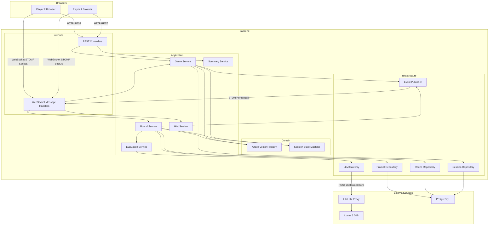
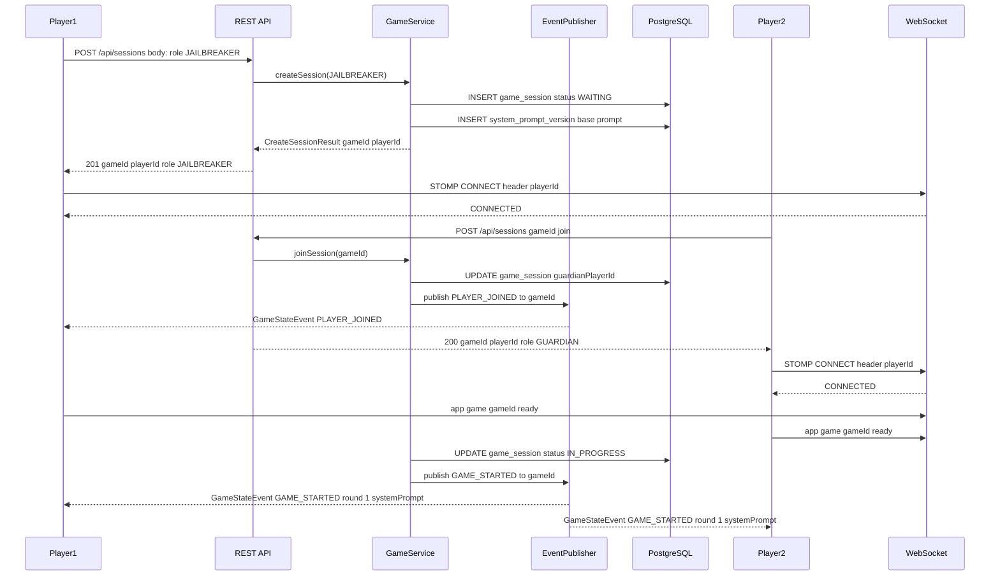
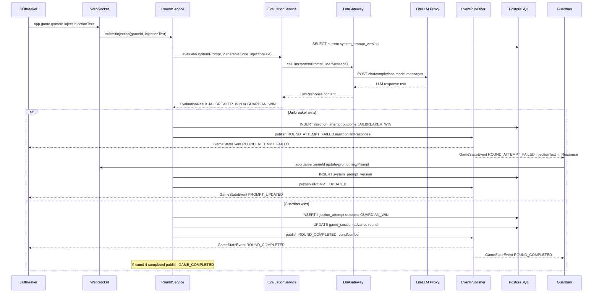

# PromptDuel

An educational, browser-based game that teaches **prompt injection attack and defense** through adversarial real-time gameplay. Two anonymous players compete: the **Jailbreakers** (red team) attempt to manipulate an LLM-powered code review assistant into ignoring a SQL injection vulnerability, while the **Guardians** (blue team) iteratively harden their system prompt to resist each attack.

---

## Overview & Features

- **Anonymous sessions** — no account or registration required; join with a shareable Game ID
- **Real-time two-player gameplay** — WebSocket (STOMP over SockJS) delivers outcomes instantly to both players
- **Four ordered attack vectors** — Direct Override → Role Confusion → Context Manipulation → Indirect Injection
- **Two-tier hint system** — Guardians can request a contextual hint or a concrete defensive example per round
- **Session persistence** — game state survives disconnection; either player can reconnect using the original Game ID
- **Permanent summary URL** — `/summary/{gameId}` is accessible indefinitely, no authentication required
- **Image export** — session summary can be exported as an image via client-side `html2canvas`
- **Model-agnostic LLM layer** — LiteLLM proxy abstracts the underlying model; swap models via config, no code changes

---

## Prerequisites

Install all runtime tools via [mise](https://mise.jdx.dev/):

```bash
mise install
```

The following tool versions are pinned in `.mise.toml`:

| Tool  | Version       |
|-------|---------------|
| Java  | Temurin 21    |
| Maven | 3.9.9         |
| Node  | 22            |
| pnpm  | 9             |

Additionally, a running **LiteLLM Proxy** instance is required (default: `http://localhost:4000`), configured to forward requests to a Llama 3 70B endpoint or any OpenAI-compatible model.

A **PostgreSQL 16** database must be reachable at the coordinates configured in `backend/src/main/resources/application.yml`.

---

## Installation

```bash
# Clone the repository
git clone <repo-url>
cd promptduel

# Install all runtime tools
mise install

# Install frontend dependencies
cd frontend && pnpm install && cd ..
```

### Backend

```bash
cd backend
mvn install -DskipTests
```

### Database

Database migrations are applied automatically on backend startup via **Liquibase**.
Ensure your PostgreSQL instance is running and the credentials in `application.yml` (or environment overrides) are correct before starting the backend.

---

## Usage

### Development

```bash
# Backend (from project root)
cd backend && mvn spring-boot:run

# Frontend (from project root)
mise run frontend:dev
```

The frontend dev server proxies API requests to the backend. Open `http://localhost:5173` in two browser tabs to simulate both players.

### Production Build

```bash
# Frontend
mise run frontend:build    # output: frontend/dist/

# Backend
cd backend && mvn package  # output: backend/target/*.jar
java -jar backend/target/promptduel-*.jar
```

### Available mise Tasks

| Task               | Description                              |
|--------------------|------------------------------------------|
| `frontend:dev`     | Start the Vite frontend dev server       |
| `frontend:build`   | Build the frontend for production        |
| `frontend:test`    | Run frontend unit tests                  |
| `frontend:lint`    | Lint frontend source with ESLint         |
| `backend:lint`     | Check Kotlin code style with ktlint      |
| `backend:lint-fix` | Auto-format Kotlin sources with ktlint   |

Run any task with:

```bash
mise run <task-name>
```

---

## Configuration

All backend configuration lives in `backend/src/main/resources/application.yml`. The most important settings:

| Property                        | Default              | Description                                |
|---------------------------------|----------------------|--------------------------------------------|
| `spring.datasource.url`         | —                    | PostgreSQL JDBC URL                        |
| `spring.datasource.username`    | —                    | Database username                          |
| `spring.datasource.password`    | —                    | Database password                          |
| `litellm.host`                  | `localhost`          | LiteLLM proxy host                         |
| `litellm.port`                  | `4000`               | LiteLLM proxy port                         |
| `litellm.model`                 | `local-smart`        | Model name forwarded to LiteLLM            |
| `litellm.timeout-ms`            | `30000`              | Request timeout in milliseconds            |
| `LITELLM_MASTER_KEY`            | *(env var)*          | LiteLLM authentication key                 |
| `promptduel.cors.allowed-origin`| —                    | Frontend origin allowed by CORS            |
| `promptduel.input.max-injection`| `2000`               | Max characters for an injection attempt    |
| `promptduel.input.max-prompt`   | `4000`               | Max characters for a system prompt         |

Frontend environment variables (set in `frontend/.env.local`):

| Variable                    | Description                        |
|-----------------------------|------------------------------------|
| `VITE_API_BASE_URL`         | Backend REST base URL              |
| `VITE_WS_ENDPOINT_URL`      | Backend WebSocket endpoint URL     |

Health check: `GET /actuator/health`

---

## Architecture

### Pattern

The backend follows **Hexagonal / Clean Architecture** with four distinct layers: Domain, Application, Infrastructure, and Interface. The game domain is fully isolated from I/O concerns.

### Component Map



### Session Setup Flow



### Round Turn Flow



### Technology Stack

| Layer              | Technology                                      |
|--------------------|-------------------------------------------------|
| Frontend           | React 19 + TypeScript 5.x (Vite)               |
| WebSocket Client   | @stomp/stompjs 7.x + sockjs-client 1.x         |
| State Management   | React Context + useReducer                      |
| Image Export       | html2canvas 1.x (client-side)                  |
| Backend            | Kotlin 2.2 + Spring Boot 4.0                   |
| WebSocket Broker   | Spring STOMP in-memory SimpleBroker             |
| LLM Proxy          | LiteLLM Proxy (Python, port 4000)              |
| Primary LLM        | Llama 3 70B (self-hosted, via LiteLLM)         |
| Database           | PostgreSQL 16 (Spring Data JPA + Hibernate)    |
| Build              | Maven (backend) / pnpm (frontend)              |

### REST API Reference

| Method | Endpoint                              | Description                        |
|--------|---------------------------------------|------------------------------------|
| POST   | `/api/sessions`                       | Create a new session, choose role  |
| POST   | `/api/sessions/{gameId}/join`         | Join an existing session           |
| GET    | `/api/sessions/{gameId}/summary`      | Retrieve full session summary      |
| GET    | `/api/sessions/{gameId}/hints`        | Get a tier-1 or tier-2 hint        |
| GET    | `/summary/{gameId}`                   | Public permanent summary page      |

### WebSocket Destinations (client → server)

| Destination                              | Description                          |
|------------------------------------------|--------------------------------------|
| `/app/game/{gameId}/ready`               | Signal player readiness              |
| `/app/game/{gameId}/inject`              | Submit an injection attempt          |
| `/app/game/{gameId}/update-prompt`       | Update the Guardian's system prompt  |
| `/app/game/{gameId}/request-hint`        | Request a hint (tier 1 or 2)        |
| `/app/game/{gameId}/reconnect`           | Reconnect and resume session         |

Published to `/topic/game/{gameId}` (all events) and `/user/queue/game/{gameId}` (player-specific).

---

## Contributing

### Development Workflow

1. Check `.kiro/specs/promptduel/tasks.md` for the current task list and pick up the next open task.
2. Run all tests before committing:
   ```bash
   mise run test
   ```
3. Commit using [Conventional Commits](https://www.conventionalcommits.org/):
   ```
   feat(task-N): imperative description under 72 chars
   fix(auth): handle 401 on token refresh
   ```
4. Update this README if any public API, command, or configuration changes.

### Code Style

```bash
# Kotlin (check)
mise run backend:lint

# Kotlin (auto-fix)
mise run backend:lint-fix

# Frontend
mise run frontend:lint
```

### Running Tests

```bash
# Backend
cd backend && mvn test

# Frontend
mise run frontend:test
```

A git pre-commit hook runs linting automatically. Do not bypass it with `--no-verify`.
